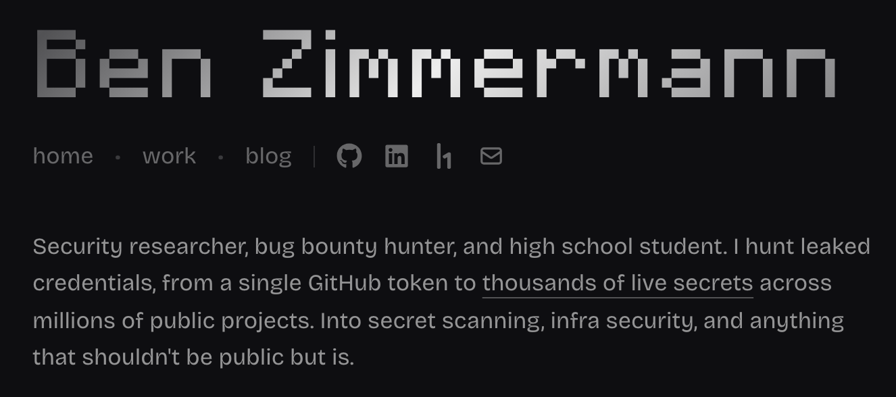

<a href="https://benzimmermann.dev"></a>

My portfolio site: [benzimmermann.dev](https://benzimmermann.dev).

Built with Next.js, React, Tailwind CSS, and Motion. Blog posts are Markdown files rendered with react-markdown and Shiki.

## Development

```sh
pnpm install
pnpm dev
```

Other scripts: `build`, `lint`, `format`, `typecheck`.

## Writing a post

Add a Markdown file to `content/blog/`. The filename is the slug.

```md
---
title: "Post title"
date: "2026-01-01"
summary: "One-line summary."
tags: ["tag"]
draft: false
---
```

Images go in `public/blog/<slug>/` and are referenced as `/blog/<slug>/image.svg`. Drafts are hidden in production.
